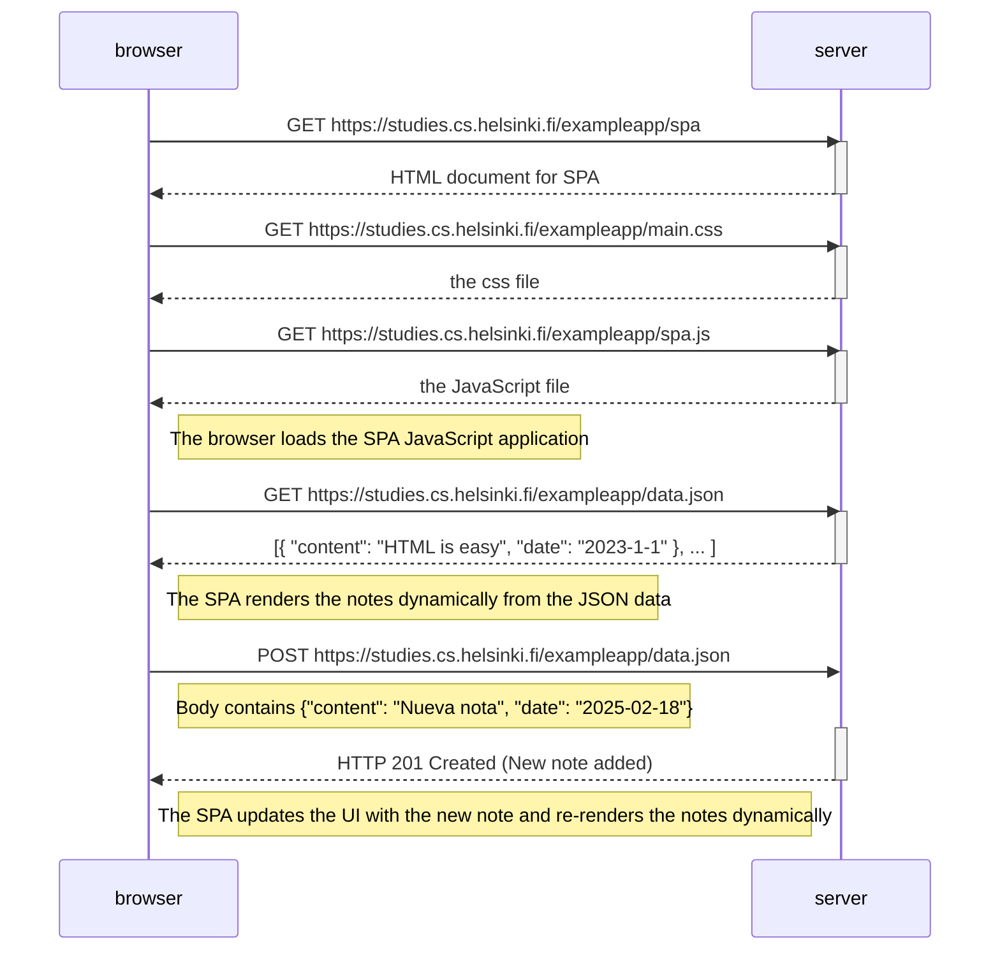

sequenceDiagram
    participant browser
    participant server

    browser->>server: GET https://studies.cs.helsinki.fi/exampleapp/spa
    activate server
    server-->>browser: HTML document for SPA
    deactivate server

    browser->>server: GET https://studies.cs.helsinki.fi/exampleapp/main.css
    activate server
    server-->>browser: the css file
    deactivate server

    browser->>server: GET https://studies.cs.helsinki.fi/exampleapp/spa.js
    activate server
    server-->>browser: the JavaScript file
    deactivate server

    Note right of browser: The browser loads the SPA JavaScript application

    browser->>server: GET https://studies.cs.helsinki.fi/exampleapp/data.json
    activate server
    server-->>browser: [{ "content": "HTML is easy", "date": "2023-1-1" }, ... ]
    deactivate server

    Note right of browser: The SPA renders the notes dynamically from the JSON data

    browser->>server: POST https://studies.cs.helsinki.fi/exampleapp/data.json 
    Note right of browser: Body contains {"content": "Nueva nota", "date": "2025-02-18"}
    activate server
    server-->>browser: HTTP 201 Created (New note added)
    deactivate server

    Note right of browser: The SPA updates the UI with the new note and re-renders the notes dynamically

